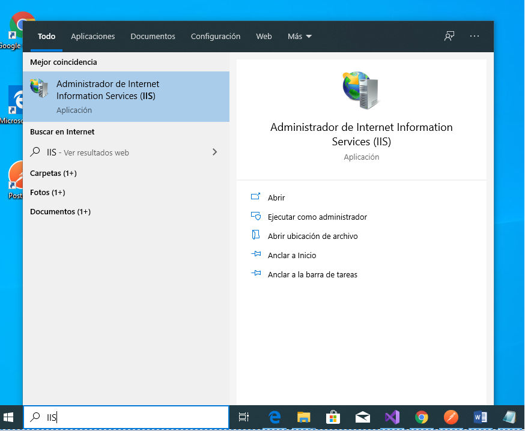
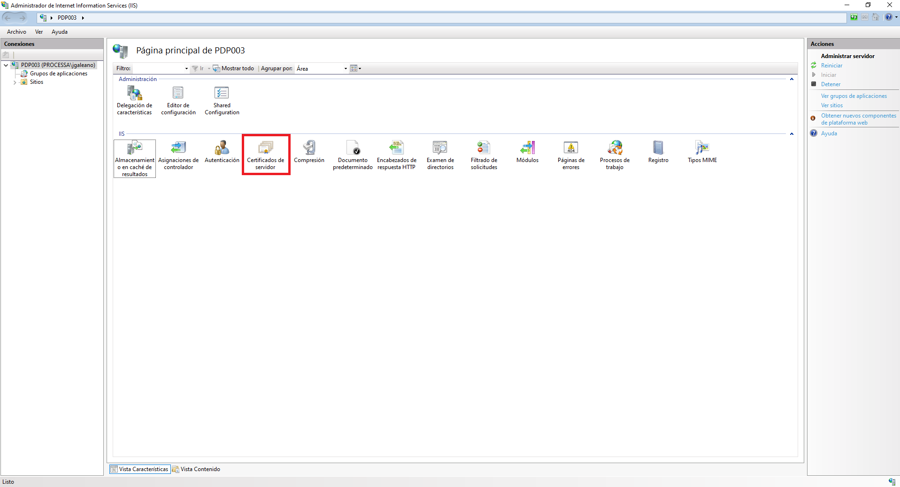
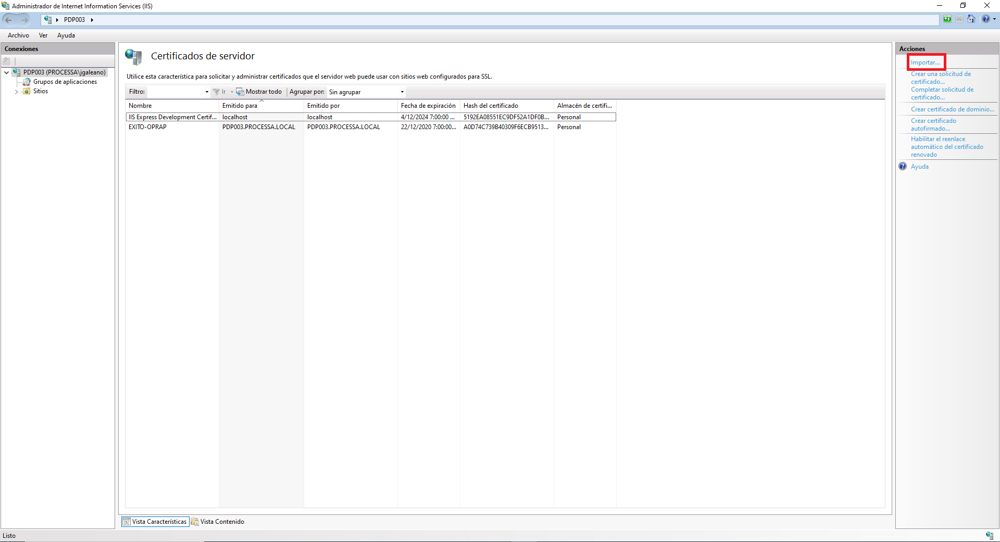
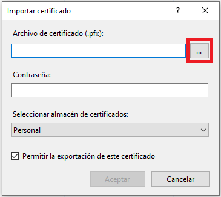

# Depósito con activación

Procesa una solicitud financiera de depósito con activación de una tarjeta.

| Verbo | Endpoint                                      | Requiere autenticación |
| :---: | --------------------------------------------- | :--------------------: |
| POST  | http://localhost/financial/deposit            |          [ Si ]        |


## Datos de la solicitud (body)

```json
{
  "TransactionId": "f4t14a9b-42b1-4dde-a45d-4568a99b1f93",
  "Account": "YPjZbxCT3ABC2MBl74uuWvu6mBNa9BO3JUiLA9qc0+uYl4WeJ12PGgvxq3VrKVq3vRE5M0HjRNyDUKuv3+boXk1AvjLLXgB1nF1bGeZOg+ASx0euXajFE/4Kwg2bHF1QmlVakn6vZzDBanptkXIzAU9CrnCoEnrtuUgZmCwasiY=",
  "AccountType": "11",
  "AcquirerId": "20000000001",
  "CardAcceptor": "000000000000013",
  "CardAcceptorName": "Almacen prueba",
  "TerminalId": "132456",
  "Amount" : 99999
}
```

### Valores de la solicitud

Campo | Tipo de dato| Descripción | Requerido
:---: | :----------:| ----------- | :-------:
TransactionId | string |Identificador de la transacción enviada.| [Si]
Account | string | Número de la tarjeta que se va a activar. Se debe enviar com una cadena cifrada con certificado de confianza. | [ Si ]
AccountType | string | Identificador del tipo de cuenta asociado a la tarjeta. Generalmente este valor lo debe "ingresar/seleccionar/establecer" el usuario y/o comercio en el punto de pago. Corresponde con una lista de valores predefinidos por Evertec Colombia. | [ Si ]
AcquirerId | string | Identificador del adquiriente que realiza la activación de la tarjeta. | [ Si ]
CardAcceptor | string | Código del álmacen desde el cual se realiza la activación de la tarjeta. | [ Si ]
CardAcceptorName | string | Nombre del álmacen desde el cual se realiza la activación de la tarjeta. | [ Si ]
TerminalId | string | Identificador de la terminal desde la cual se realiza la operación de la activación de la tarjeta. | [ Si ]
Amount | int | Valor de la transacción (activación). Cantidad de dinero con el que se activa la tarjeta. | [ Si ] 

## Datos de la respuesta
Esta operación no retorna información adicional al código de estado de HTTP de acuerdo con la especificación RFC 2616. Si la respuesta no es `HttpStatus` 200, en el campo `Reason` de la respuesta encontrará un mensaje que describe de forma detallada el resultado de la operación.

### Valores de respuesta más utilizados

HttpStatus | Tipo | Descripción
:---: | :--------: | ------------
200 | int | La transacción de depósito con activación de la tarjeta se realizó de manera satisfactoria.
400 | int | Error en los datos enviados para realizar la transacción.
401 | int | La solicitud requiere autenticación de usuario. Debe repetir la solicitud con un campo de encabezado de autorización adecuado con las credenciales de autorización otorgadas.
406 | int | La transacción de depósito con activación de la tarjeta no se pudo realizar de manera satisfactoria.

Cuando el estatus de la operación es 200 (exitoso), el cuerpo de la respuesta incluye el número de autorización generado:

```json
{
  "AuthNumber": "999999"
}
```

### Importación Certificado de Seguridad Encripción y Desencripción PAN

En el envío del JSON o conjunto de parámetros de entrada, que son el insumo inicial del consumo del servicio 'Conversor' asociado a la transacción 'Depósito con Activación'. Es obligatorio cifrar el valor del PAN de la cuenta asociada al cliente por seguridad y posteriormente desemcriptarla para procesar la transacción en Postiliom.

Se debe importar el certificado de seguridad denominado 'SSL_OPRAP' de la siguiente forma:


1. En la barra de tareas de Windows buscar 'IIS':



2. Hacer clic sobre el link 'Certificados de Servidor':



3. En el panel derecho 'Acciones' hacer clic sobre el link 'Importar':



4. Hacer clic sobre el botón de busqueda '...':



5. Buscar el archivo SSL_OPRAP.pfx y seleccionarlo y luego hacer clic sobre el botón 'Abrir':


6. Finalmente el resultado se visualiza en la siguiente imágen:


